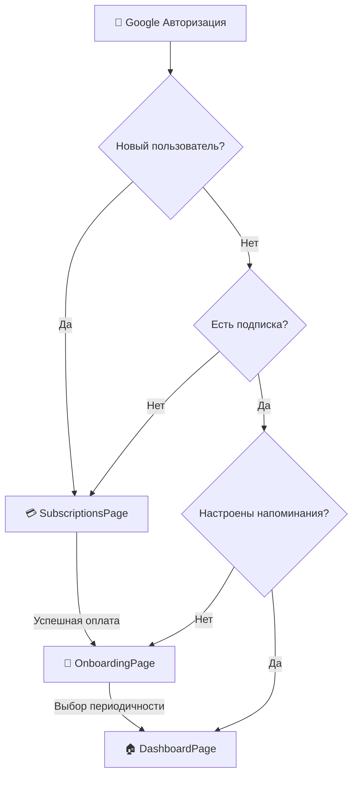

# 🔄 Новый поток пользователя

## Изменение порядка: Подписка → Периодичность

Исправлен порядок онбординга для нового пользователя:

### ❌ Старый поток
```
Вход → Выбор периодичности → Подписка → Главная
```

### ✅ Новый поток 
```
Вход → Подписка → Выбор периодичности → Главная
```

## Подробная схема



## Изменения в коде

### 1. `useUserState.ts` - изменен порядок проверок
```typescript
const determineUserFlow = () => {
  if (!user) return 'login';
  // ✅ ПЕРВЫМ проверяем подписку
  if (!user.subscription || user.subscription === 'none') return 'subscription';
  // ✅ ВТОРЫМ проверяем онбординг
  if (!user.hasCompletedOnboarding) return 'onboarding';
  return 'dashboard';
};
```

### 2. `GoogleLoginButton.tsx` - обновлена логика переадресации
```typescript
// ✅ Новые пользователи сначала идут на подписки
if (data.needsSubscription || data.isNewUser) {
  setLocation('/subscriptions');
} else if (!data.user.hasCompletedOnboarding) {
  setLocation('/onboarding');
} else {
  setLocation('/dashboard');
}
```

### 3. `SubscriptionsPage.tsx` - после оплаты → на онбординг
```typescript
// ✅ После успешной оплаты идем на настройку напоминаний
toast({
  title: "🎉 Підписку активовано!",
  description: `Тепер налаштуємо нагадування...`,
});
setLocation('/onboarding');
```

### 4. `OnboardingPage.tsx` - после настройки → на главную
```typescript
// ✅ После настройки периодичности идем на главную
setTimeout(() => {
  setLocation('/dashboard');
}, 100);
```

## Логика для разных типов пользователей

### 🆕 Новый пользователь (первый вход)
1. **Google авторизация** → создается аккаунт
2. **SubscriptionsPage** → выбор и оплата подписки  
3. **OnboardingPage** → выбор периодичности напоминаний
4. **DashboardPage** → основная работа с приложением

### 🔄 Существующий пользователь без подписки
1. **Google авторизация** → вход в существующий аккаунт
2. **SubscriptionsPage** → нужно выбрать подписку
3. **OnboardingPage** → настроить напоминания (если не настроены)
4. **DashboardPage** → основная работа

### ✅ Пользователь с подпиской
1. **Google авторизация** → вход
2. **OnboardingPage** → настройка напоминаний (если не завершен онбординг)
3. **DashboardPage** → основная работа

### 🏆 Полностью настроенный пользователь
1. **Google авторизация** → сразу на **DashboardPage**

## Преимущества нового потока

✅ **Логично**: Сначала пользователь понимает ценность продукта через подписку  
✅ **Мотивация**: После оплаты пользователь более мотивирован настроить напоминания  
✅ **Конверсия**: Меньше шансов, что пользователь уйдет после настройки напоминаний  
✅ **UX**: Четкий линейный поток без возвратов

## Статусы пользователя

| Состояние | subscription | hasCompletedOnboarding | Направление |
|-----------|-------------|------------------------|-------------|
| Новый | `none` | `false` | → Subscriptions |
| Оплатил | `light/plus/pro` | `false` | → Onboarding |
| Настроил | `light/plus/pro` | `true` | → Dashboard |
| Без подписки | `none` | `true` | → Subscriptions | 